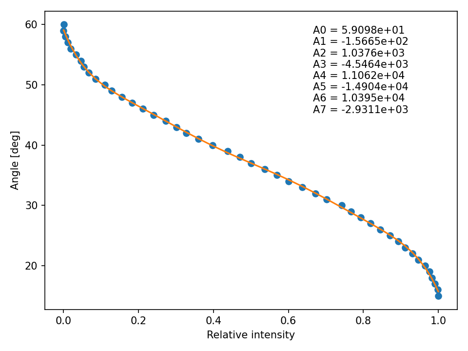

# EL14 controler with nodeMCU


[toc]

## How to use
### Power up
EL14 is managed with commands sent with http protocole over intranet. On boot nodeMCU will try to connect to lab WiFi and set up a server. Server (at most cases) takes ip `172.17.32.174`. If the ip is different, the last part will be near number (173, 175). It can be checked also on router website in connections map section. This ip address should be given to handler.

**Important**. On power-up, nodeMCU boots and state of some of the pins changes. EL14 sees it as an attempt of serial communication and responds with errors. This changes the state of nodeMCU and it doesn't boot properly. **During boot, the devices should be disconnected!**. Half a second is enough, then nodeMCU goes into initialisation procedures and can be connected back. Also, on power-up, EL14 calibrates resonant frequencies and it can take some time. NodeMCU waits for 5 s, but if it is not enough just don't connect the device back before the EL14 stops.

### Pin description
* D0 - in motion state input
* D1 - jog enable output
* D2 - jog forward output
* D3 - jog backward output
* D6 - trigger
* D7 - serial RX (should be connected to TX of EL14)
* D8 - serial Tx (should be connected to RX of EL14)
* A0 - photodiode analog input with ranges 0 - 3.3 V

### Command mode

#### Command syntax
Available commands are listed in section below. Command syntax follows url syntax from http protocole and looks like this: `http://device_ip/command?key1=value1&key2=value2`. For example if device is hosting a server under ip address 172.17.32.174 and one wants to rotate it to absolute position of 72.3 deg, the url will look like this: `http://172.17.32.174/move_absolute?deg=72.3`. If one wants to set new `_angle_min` and `_angle_max` values, the url will look like this: `http://172.17.32.174/set_min_max?min=0&max=100`.

**Important.** Parameters of commands which need them are obligatory for stable work of the device.

If one wants to use python for control an exemplary script for setting speed with angle-time command, homing the device and rotating by arbitrary angle is shown below.

```python
import requests

url = 'http://172.17.32.174/'
speed_angle = 100 # deg
speed_time = 0.1 # s
angle = 100 # deg

requests.get(
	url + 'set_angle_time',
	params={
		'angle' : speed_angle,
		'time' : speed_time
	}
)
requests.get(
	url + 'home',
	params={
		'dir' : 1
	}
)
requests.get(
	url + 'move_relative',
	params={
		'deg' : angle
	}
)
```

#### Cicero
When working with Cicero, the commands names are the same, however architecture of handler doesn't allow for key-value syntax. All commands are sent with key `params` in order set in Cicero RS232 group. Software version compatible with Cicero reads those parameters in set order. If one wants to use software version with key-value syntax, handling functions in server part need to be changed (different parts of code already written should be used). Example is shown below.

Key-value code:

```c++
void handle_set_min_max() {
  /*
  set_min(server.arg(0).toFloat());
  set_max(server.arg(1).toFloat());
  */
  for (uint8_t i = 0; i < server.args(); i++) {
    if(server.argName(i) == (const String)"min") {
      set_min(server.arg(i).toFloat());
    }
    else if(server.argName(i) == (const String)"max") {
      set_max(server.arg(i).toFloat());
    }
  }
  
  server.send(200, "text/html", "Min and max set");
}
```

Cicero compatible code:

```c++
void handle_set_min_max() {
  set_min(server.arg(0).toFloat());
  set_max(server.arg(1).toFloat());
  /*
  for (uint8_t i = 0; i < server.args(); i++) {
    if(server.argName(i) == (const String)"min") {
      set_min(server.arg(i).toFloat());
    }
    else if(server.argName(i) == (const String)"max") {
      set_max(server.arg(i).toFloat());
    }
  }
  */
  server.send(200, "text/html", "Min and max set");
}
```

### Jog mode
The device can be rotated in jog mode, where the movement is not caused by a command set, but by changing jog pins states. This mode doesn't need the communication and thus doesn't have time delay between the procedure start and movement. After jog step is done, the device sends a response through serial about its current position - here some delay may be built up.

In jog mode the device can be rotated forward or backward by a predefined step. Jog step can be set with request `set_jog_step`.

### Trigger mode
Device can be triggered on pin D6 which calls external interrupt handling routine. This function stops current job of the nodeMCU and moves the stage to previously set position. This mode should be used when all other requests are done and device is ready as it may interfere with the request handling. It is useful when one wants to have precise timing of the rotation.

By default, the device rotates to `_angle_trig_start` position when request `start` is called. Then, on trigger moves to position `_angle_trig_stop`. Both `_angle_trig_start` and `_angle_trig_stop` parameters can be set using either `set_trigger_angles` or `set_trigger_power` requests. In first case one inputs arbitrary angles, in second one inputs relative power which device converts to angles using calibration curve fit.

To change the behaviour on trigger, function `rot_stage::handle_trig_interrupt` needs to be modified.

**Important!** If trigger handling function uses commands to rotate the stage there is a constant delay of 20 ms between the trigger rise and the rotation. If jog functions are used, the rotation is instantenous upon trigger. **By default the trigger interrupt handling routine uses jog functions.** This can be changed in `rot_stage::handle_trig_interrupt`.

### Flashing new software
Flashing new software faces the same problems as power up part - serial communication cross. For the upload of new software the devices should be disconnected. Current software in PlatfromIO project can be downloaded from gDrive [here](https://drive.google.com/drive/folders/1zUkqIa4bSzibQwh4zjUx1g9AN25MgS32?usp=sharing) or from github [here](https://github.com/einaudi/EL14-rotational-stage-controller.git).

PlatformIO is a extension for VisualCodeStudio which is really helpful with microcontroller programming. To use it, add it to your VisualCode extensions and a new tab should appear with alien-ant-alike logo. Then download the project directory and open it using PlatformIO (not by Visual File > Open). Then one can modify the project or build it (it means compile everything in dependency tree) and upload. Sometimes small changes need to be done in platformio.ini file, such as COM port the device is connected to.

### Calibration curve 
After installing the stage in the setup we performed a calibration and got angle vs relative power dependence, to which a 7th order polynomial was fitted. Curve plot and fitted coefficients values are shown below.




### Cicero sequence scheme
The device has `receive_data` parameter equal to `false` which means it doesn't get `start` and `end` requests from handler. However, they are included in server paths for future development or specific needs. Main idea is that if user wants to rotate the device it should be called explicitly, so one can trace all delays in the system.

To properly use the trigger mode a schema should be used:

1. `set_trigger_[angles/power]` - device sets trigger parameters and rotates to `_angle_trig_start` position
2. trigger call - when trigger signal rises the stage rotates to `_angle_trig_stop` position

## Available server paths
### `home`
Rotates the stage to home position. By default it is absolute 0 deg.  
Parameters:

* dir - direction of rotation - 0 for clockwise ant 1 for counterclockwise.

Cicero syntax: `home@dir\n`

### `move_absolute`
Rotates the stage to absolute position.  
Parameters:  

* deg - new absolute position angle [deg]c

Cicero syntax: `move_absolute@deg\n`

### `move_relative`
Rotates the stage by specified angle from its current position. Positive angle rotates clockwise, negative angle rotates counterclockwise.  
Parameters:  

* deg - angle [deg] to rotate by

Cicero syntax: `move_relative@deg\n`

### `move_power`
Rotates the stage to absolute position at which relative power of the beam is equal to the input parameter. Device does the conversion automatically with parameters from calibration curve.  
Parameters:

* power - relative power (values 0-1) to rotate to 

### `move_fwd`
Rotate forward by angle defined as jog step.

Cicero syntax: `move_fwd@\n`

### `move_bwd`
Rotate backward by angle defined as jog step.

Cicero syntax: `move_bwd@\n`

### `move_min`
Rotate to absolute position defined as `_angle_min`. `_angle_min` can be set by command or by calibration and is stored in non-volatile memory (it is remembered after power down).

Cicero syntax: `move_min@\n`

### `move_max`
Rotate to absolute position defined as `_angle_max`. `_angle_max` can be set by command or by calibration and is stored in non-volatile memory (it is remembered after power down).

Cicero syntax: `move_max@\n`

### `set_speed`
Set the speed of the device. Value is encoded in percentage of maximal speed. Measured [deg/s] vs [%] calibration is shown in the plot below. Formula fitted to data points was:  
$f(x)=\frac{A_6}{x-A_7}+A_0+A_1x+A_2x^2+A_3x^3+A_4x^4+A_5x^5$  
This calibration may be dependent on load attached to the stage. Guess is, that it won't be for small and light objects. It was measured with a linear polarizer.  
It is hard to measure it with the device itself, so it should be done externally with oscilloscope and higher data analysis capabilities than the device has. I've done it in such a way, that I chose two angles that result in different light intensity measured, one lower and one higher. Then I measured the temporal intensity change for different percentage speed and with python analysed them to obtain the time in which the device rotates. From that and angles difference I was able to get the calibration curve.  
Parameters:

* v - speed of the device in percentage of maximal speed

Cicero syntax: `set_speed@v\n`


### `set_jog_step`
Set the angle by which stage rotates when in jog mode. Jog step in stored in `_jog_step` variable and is remembered after power-down.  
Parameters:

* step - jog step [deg] to set

Cicero syntax: `set_jog_step@step\n`

### `set_angle_time`
Sets the speed such that rotation by input angle will take input time. This request changes just the **speed** of the device, it doesn't move anything.  
Parameters:

* angle - rotation angle [deg]
* time - time [s] the rotation by angle should take

Cicero syntax: `set_angle_time@angle_time\n`

### `set_min_max`
Set `_angle_min` and `_angle_max` parameters. They are also stored in non-volatile memory and will be remembered after power-down.  
Parameters:

* min - angle [deg] to be set as `_angle_min`
* max - angle [deg] to be set as `_angle_max`

Cicero syntax: `set_min_max@min_max\n`

### `calibration_min_max`
Turns on the calibration of `_angle_min` and `_angle_max` procedure. The stage goes to 0 deg absolute position and starts to rotate by 1 deg up to 120 deg (in this range it should cover polarizer/half-waveplate range of intensity change). At each position a measurement of light intensity is taken - photodiode must be connected. New values of `_angle_min` and `_angle_max` are calculated where the intensity is minimal and maximal respectively. If the angular range of calibration is too broad it needs to be changed as the procedure may detect two minimas/maximas and not acquire the following angles correctly.

Cicero syntax: `calibration_min_max@\n`

### `set_calibration_ranges`
Set the ranges of angles for which the calibration is done. Values are stored in non-volatile memory and will be remembered after power-down.  
Parameters:

* min - start angle [deg] of calibration
* max - end angle [deg] of calibration

Cicero syntax: `set_calibration_ranges@min_max\n`

### `set_trigger_angles`
Set `_angle_trig_start` and `_angle_trig_stop` and time the rotation between them should take. Jog step is changed so it is equal to the difference of start and stop angles.   
**Important!** This function also changes the speed settings and jog step.  
Parameters:

* start - angle to start the rotation from, device rotates to this position when `start` request is called
* stop - angle to rotate to once triggered
* time - time the rotation from start to stop should take

Cicero syntax: `set_trigger_angles@start_stop_time\n`

### `set_trigger_power`
Set `_angle_trig_start` and `_angle_trig_stop` by relative power and time the rotation between them should take. Jog step is changed so it is equal to the difference of start and stop angles. Device automatically converts relative power to angles using fit to calibration curve.  
**Important!** This function also changes the speed settings and jog step.  
Parameters:

* start - relative power (values 0 - 1)  to start the rotation from, device rotates to this position when `start` request is called
* stop - relative power (values 0 - 1) to rotate to once triggered
* time - time the rotation from start to stop should take

Cicero syntax: `set_trigger_power@start_stop_time\n`

## Cicero handler server paths
### `getdata`
Returns available commands of the server for handler purposes.

### `test`
Return `OK` for handler purposes

### `start`
Called at the beginning of the sequence. Rotates the device to `_angle_trig_start` position.

### `addproperty`
Returns code `200`, but does nothing. Just not to crush handler.

### `end`
Called at the end of the sequence. Rotates the device to `_angle_min` position.